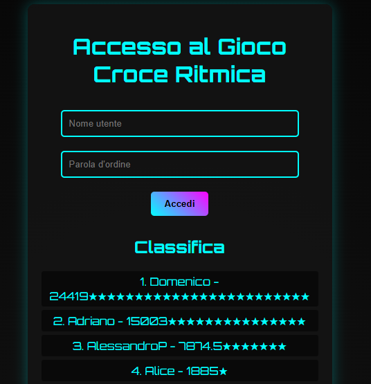
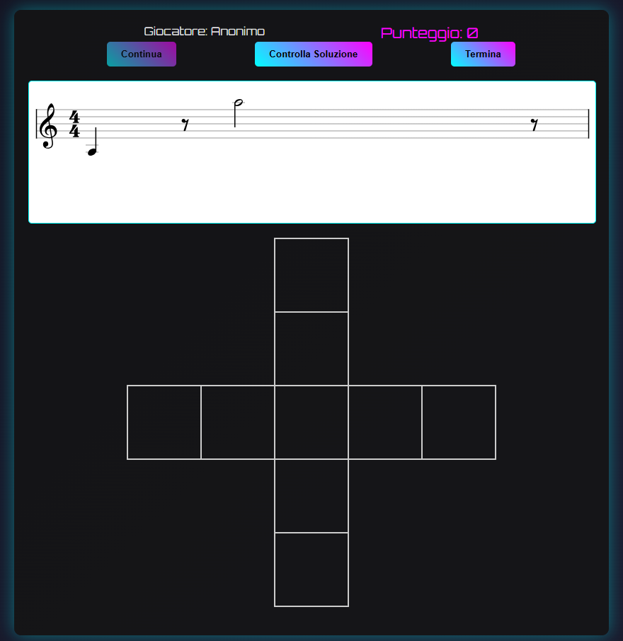
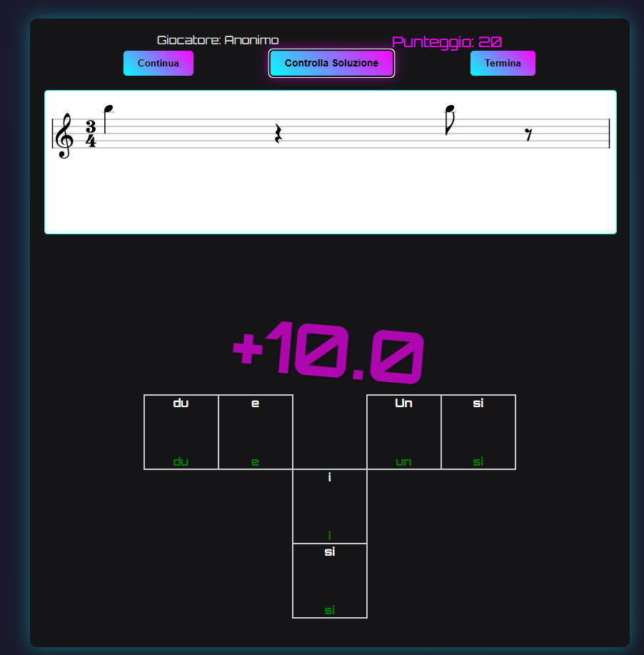
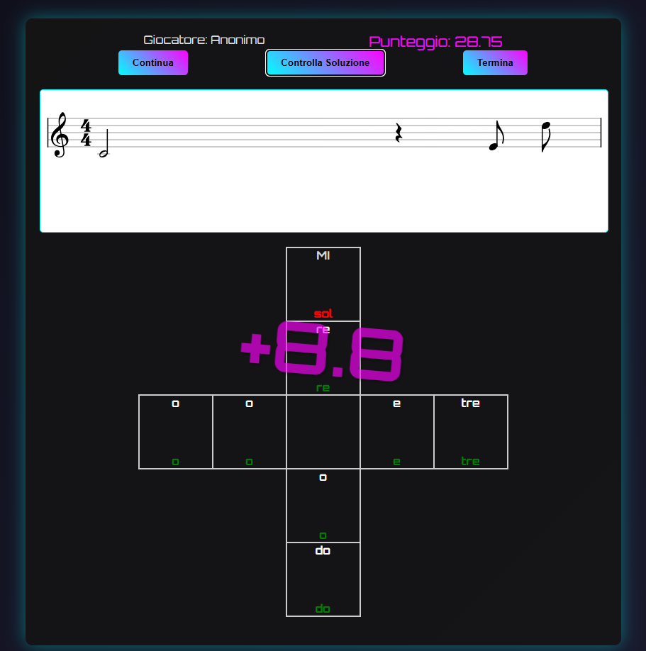

# Croce Ritmica

A gamified rhythm-learning web application designed to help beginner music students practice rhythm recognition, note-duration reading and syllabic rhythmic subdivision.

The tool was developed for real students in a music education context, with the goal of transforming rhythm-reading exercises into an interactive web game with scoring, feedback and leaderboard-based motivation.

## Live Demo

[Open the deployed application](https://www.accademiamusicalegirolamoscarasciullo.com/GiocoCroceRitmica/index.html)

## Problem

Beginner music students often find rhythm reading difficult because they need to connect several concepts at the same time:

- note and rest duration;
- time signatures;
- rhythmic subdivision;
- syllabic pronunciation;
- visual reading on the staff.

Traditional rhythm exercises can become repetitive and may not always provide immediate feedback or a clear sense of progression.

## Solution

Croce Ritmica provides an interactive rhythm game where students read a generated rhythmic pattern and complete a cross-shaped syllable grid.

The application combines music notation rendering, editable answer cells, scoring logic, sound feedback and leaderboard progression to make rhythm practice more engaging.

## Main Features

- Random rhythm generation in different time signatures
- Staff rendering with VexFlow
- Notes, rests and tied notes
- Interactive cross-shaped answer grid
- Automatic solution checking
- Score calculation
- Leaderboard persistence
- Login-based student score tracking
- Anonymous play mode
- Sound feedback and background music
- Certificate modal for achievement-based feedback

## Screenshots


### Log in
<p align="center">
  
</p>

### Start the game
<p align="center">
  
</p>

### Positive feedback
<p align="center">
  
</p>

### Negative feedback
<p align="center">
  
</p>

## Technical Overview

The application follows a lightweight full-stack architecture:

| Layer | Technologies | Responsibility |
|---|---|---|
| Frontend | HTML, CSS, JavaScript, jQuery | User interface, interaction logic, editable answer grid and score display |
| Music Notation | VexFlow | Staff rendering, notes, rests, time signatures and ties |
| Backend | PHP | Login, session management, current user retrieval and leaderboard updates |
| Storage | JSON files | Local user credentials and leaderboard data |
| Media | Audio files and PDF certificate | Sound feedback, background music and achievement reward |

The project is intentionally lightweight and can be deployed on a standard PHP-enabled hosting environment.

## Learning Workflow

The application supports a rhythm-practice loop:

```text
Student logs in or plays anonymously
        |
        v
Generate a random rhythm pattern
        |
        v
Display the rhythm on the staff
        |
        v
Student fills the rhythmic syllable grid
        |
        v
Check the solution automatically
        |
        v
Show correct and incorrect answers
        |
        v
Update score and leaderboard
```

## Classroom Use and Observed Results

The tool was used in a real music education context with a class of 28 students with different starting levels.

The activity was not used as a replacement for traditional solfeggio, but as a support tool alongside handwritten rhythmic crosses, oral rhythm subdivision exercises and rhythm patterns drawn in the air during class.

At the beginning of the activity, the class included:

- students who had already studied solfeggio for several years and could subdivide note durations with reasonable confidence;
- students who were hesitant and often avoided answering during traditional oral exercises;
- students who were approaching rhythm reading for the first time;
- 10 younger children within the full group of 28 students.

The application was introduced as a gamified practice tool. Students were encouraged to use it as a support exercise, while a classroom tournament was organized to increase motivation. The tournament ended at the end of the academic year with a prize for the highest score, while students reaching intermediate achievement thresholds were rewarded with certificates.

### Observed learning outcomes

| Observation | Initial situation | After regular use |
|---|---|---|
| Rhythm subdivision | Very heterogeneous: some students were confident, others were hesitant or silent during oral exercises | More fluent subdivision and faster recognition of rhythmic structures |
| Classroom confidence | Several students avoided exposing themselves during traditional exercises | Increased participation through game-based practice and feedback |
| Autonomy | Many students required teacher guidance to complete rhythmic crosses | Most students became able to complete the activity independently |
| After 1 month | — | Most students showed no major doubts during the activity |
| After 2 months | — | 26 out of 28 students showed stable fluency and confidence |
| Final observed autonomy | — | By the end of the activity, 27 out of 28 students reached autonomous use of the exercise workflow |

### Leaderboard engagement

A leaderboard snapshot was used to monitor practice engagement among tracked student profiles.

| Metric | Value |
|---|---|
| Total class size | 28 students |
| Tracked leaderboard profiles | 20 profiles |
| Total accumulated score in the snapshot | 55,649.12 points |
| Median tracked score | 487.77 points |
| Highest tracked score | 24,419 points |
| Score range | 10 to 24,419 points |

The leaderboard showed very different levels of practice intensity among students. This was useful not only as a scoring mechanism, but also as a motivational tool: students were encouraged by visible progression, achievement thresholds and the final classroom tournament.

These results should be interpreted as observational feedback from classroom use rather than as a controlled experimental study.

## Rhythm Generation and Checking Logic

The game randomly selects a time signature among:

```text
2/4, 3/4, 4/4
```

For each round, it generates a rhythm sequence using notes and rests with different durations.

The application maps the generated rhythm to a syllabic solution grid. Each cell in the cross-shaped table corresponds to a rhythmic subdivision. When the student checks the solution, the application compares each user-entered syllable with the expected one.

Correct answers increase the round score, while incorrect answers reveal both the expected syllable and the submitted answer.

## Project Structure

```text
croce-ritmica/
├── index.html                  # Main application page
├── style.css                   # Application styling and responsive layout
├── get_current_user.php        # Returns the current logged-in user and score
├── get_leaderboard.php         # Returns sanitized leaderboard data from private storage
├── login.php                   # Login endpoint
├── update_leaderboard.php      # Leaderboard update endpoint
├── js/
│   ├── audio.js                # Audio playback module
│   ├── game.js                 # Rhythm generation, rendering and answer checking
│   ├── helpers.js              # Utility functions for durations, note names and syllables
│   ├── leaderboard.js          # Leaderboard loading and update logic
│   ├── login.js                # Login and session UI logic
│   └── main.js                 # Application initialization
├── examples/
│   ├── users.example.json      # Example local users file
│   └── leaderboard.example.json # Example local leaderboard file
├── private/
│   └── .gitkeep                # Runtime data folder, ignored by Git
├── assets/
│   └── .gitkeep                # Screenshots and repository media
├── sounds/
│   └── .gitkeep                # Optional sound files
├── attestati/
│   └── .gitkeep                # Optional certificate PDF files
└── README.md
```

## Local Setup

This project requires a PHP-enabled web server.

### 1. Clone the repository

```bash
git clone https://github.com/mikabba/croce-ritmica.git
cd croce-ritmica
```

### 2. Prepare local runtime data

The application expects runtime data in the `private/` folder.

Copy the example files:

```bash
cp examples/users.example.json private/users.json
cp examples/leaderboard.example.json private/leaderboard.json
```

Real student names, passwords and leaderboard data should not be committed to version control.

### 3. Start a local PHP server

```bash
php -S localhost:8000
```

Then open:

```text
http://localhost:8000/index.html
```

## Optional Media Files

The application references optional audio files and a certificate PDF.

Expected audio files:

```text
sounds/background.mp3
sounds/loginAccepted.mp3
sounds/loginRejected.mp3
sounds/laser.mp3
sounds/click.mp3
sounds/check.mp3
sounds/start.mp3
sounds/continue.mp3
sounds/score.mp3
sounds/end.mp3
```

Expected certificate file:

```text
attestati/AttestatoCroceRitmica.pdf
```

If these files are not present, the core game logic still remains documented, but the deployed version should include them for the complete user experience.

## Data Privacy Note

Real user credentials and leaderboard entries are runtime data and should not be committed to the public repository.

This repository includes sanitized example files only:

```text
examples/users.example.json
examples/leaderboard.example.json
```

The `.gitignore` file excludes:

```text
private/*.json
```

## Portfolio Relevance

This project complements my main engineering portfolio by demonstrating my ability to:

- translate a real educational need into a working software application;
- design interactive learning logic for beginner music students;
- implement randomized exercise generation;
- use a music-notation rendering library;
- build scoring and leaderboard mechanisms;
- organize frontend modules and PHP endpoints;
- document a deployed educational web tool.

## Known Limitations

- The current version uses JSON files for user and leaderboard storage.
- Passwords are stored in a simple local JSON file in the lightweight deployment version.
- The game logic is designed for a specific rhythm-learning workflow and may require adaptation for broader music theory use.
- The application depends on browser-based audio behavior, which may vary across devices.
- The public repository does not include real student data or production leaderboard records.

## Future Improvements

- Replace plain JSON credentials with hashed passwords
- Add admin tools for user and leaderboard management
- Add more rhythm difficulty levels
- Improve mobile responsiveness
- Add automated tests for rhythm-generation and answer-checking logic
- Consider migrating runtime data to SQLite or MySQL for larger deployments
